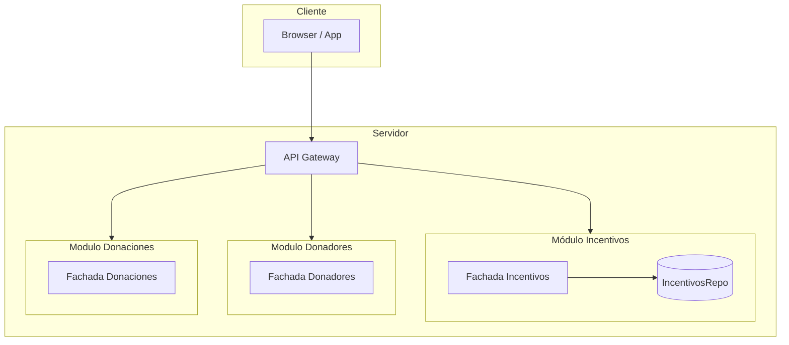

```mermaid
graph TD
    subgraph Cliente
        Browser[Browser / App]
    end

    subgraph NODO1[Servidor]
    
        Fachada[API Gateway]
        subgraph NODO1_Incentivos[Módulo Incentivos]
            Incentivos[Fachada Incentivos]
            MemoryRepo[(IncentivosRepo)]
        end

        subgraph NODO1_Donadores[Modulo Donadores]
            Donadores[Fachada Donadores]
        end

        subgraph NODO1_Donaciones[Modulo Donaciones]
            Donaciones[Fachada Donaciones]
        end
 
    end

Browser ---> Fachada
Fachada ---> NODO1_Incentivos
Fachada ---> NODO1_Donaciones
Fachada ---> NODO1_Donadores
Incentivos ---> MemoryRepo
```