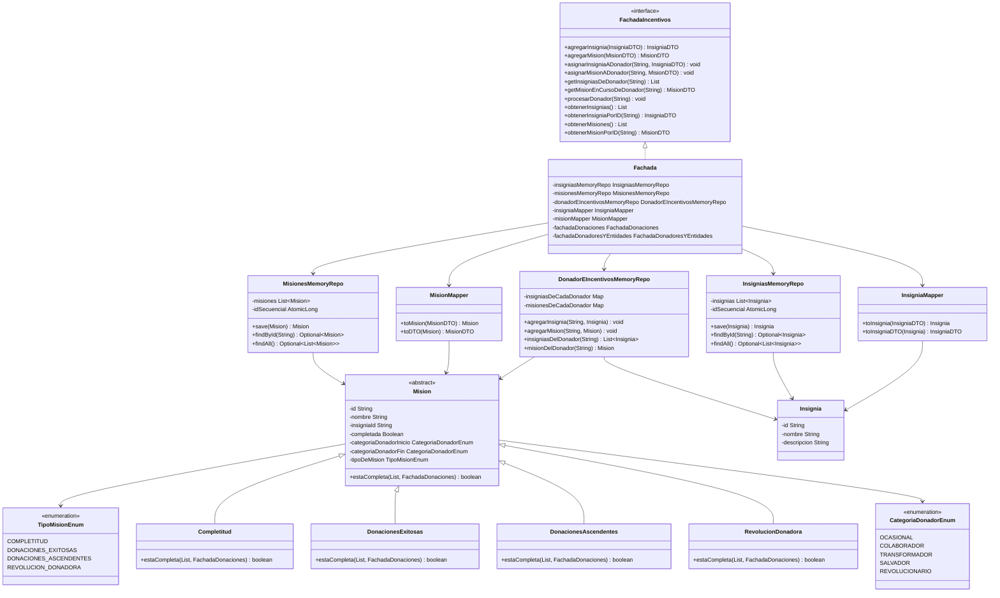

```mermaid
classDiagram
    DonadorEIncentivosMemoryRepo --> Mision
    FachadaIncentivos <|.. Fachada
    Fachada --> InsigniasMemoryRepo
    Fachada --> MisionesMemoryRepo
    Fachada --> DonadorEIncentivosMemoryRepo
    Fachada --> InsigniaMapper
    Fachada --> MisionMapper
    InsigniaMapper --> Insignia
    MisionMapper --> Mision
    InsigniasMemoryRepo --> Insignia
    MisionesMemoryRepo --> Mision
    DonadorEIncentivosMemoryRepo --> Insignia
    Mision --> TipoMisionEnum

    Mision <|-- Completitud
    Mision <|-- DonacionesExitosas
    Mision <|-- DonacionesAscendentes
    Mision <|-- RevolucionDonadora
    Mision --> CategoriaDonadorEnum

    class FachadaIncentivos {
        <<interface>>
        +agregarInsignia(InsigniaDTO) InsigniaDTO
        +agregarMision(MisionDTO) MisionDTO
        +asignarInsigniaADonador(String, InsigniaDTO) void
        +asignarMisionADonador(String, MisionDTO) void
        +getInsigniasDeDonador(String) List
        +getMisionEnCursoDeDonador(String) MisionDTO
        +procesarDonador(String) void
        +obtenerInsignias() List
        +obtenerInsigniaPorID(String) InsigniaDTO
        +obtenerMisiones() List
        +obtenerMisionPorID(String) MisionDTO
    }
    class Fachada {
        -insigniasMemoryRepo InsigniasMemoryRepo
        -misionesMemoryRepo MisionesMemoryRepo
        -donadorEIncentivosMemoryRepo DonadorEIncentivosMemoryRepo
        -insigniaMapper InsigniaMapper
        -misionMapper MisionMapper
        -fachadaDonaciones FachadaDonaciones
        -fachadaDonadoresYEntidades FachadaDonadoresYEntidades
    }
    class InsigniaMapper {
        +toInsignia(InsigniaDTO) Insignia
        +toInsigniaDTO(Insignia) InsigniaDTO
    }
    class MisionMapper {
        +toMision(MisionDTO) Mision
        +toDTO(Mision) MisionDTO
    }
    class InsigniasMemoryRepo {
        -insignias List~Insignia~
        -idSecuencial AtomicLong
        +save(Insignia) Insignia
        +findById(String) Optional~Insignia~
        +findAll() Optional~List~Insignia~~
    }
    class MisionesMemoryRepo {
        -misiones List~Mision~
        -idSecuencial AtomicLong
        +save(Mision) Mision
        +findById(String) Optional~Mision~
        +findAll() Optional~List~Mision~~
    }
    class DonadorEIncentivosMemoryRepo {
        -insigniasDeCadaDonador Map
        -misionesDeCadaDonador Map
        +agregarInsignia(String, Insignia) void
        +agregarMision(String, Mision) void
        +insigniasDelDonador(String) List~Insignia~
        +misionDelDonador(String) Mision
    }
    class Mision {
        <<abstract>>
        -id String
        -nombre String
        -insigniaId String
        -completada Boolean
        -categoriaDonadorInicio CategoriaDonadorEnum
        -categoriaDonadorFin CategoriaDonadorEnum
        -tipoDeMision TipoMisionEnum
        +estaCompleta(List, FachadaDonaciones) boolean
    }
    class Completitud {
        +estaCompleta(List, FachadaDonaciones) boolean
    }
    class DonacionesExitosas {
        +estaCompleta(List, FachadaDonaciones) boolean
    }
    class DonacionesAscendentes {
        +estaCompleta(List, FachadaDonaciones) boolean
    }
    class RevolucionDonadora {
        +estaCompleta(List, FachadaDonaciones) boolean
    }
    class Insignia {
        -id String
        -nombre String
        -descripcion String
    }
    class CategoriaDonadorEnum {
        <<enumeration>>
        OCASIONAL
        COLABORADOR
        TRANSFORMADOR
        SALVADOR
        REVOLUCIONARIO
    }
    class TipoMisionEnum {
        <<enumeration>>
        COMPLETITUD
        DONACIONES_EXITOSAS
        DONACIONES_ASCENDENTES
        REVOLUCION_DONADORA
    }
```